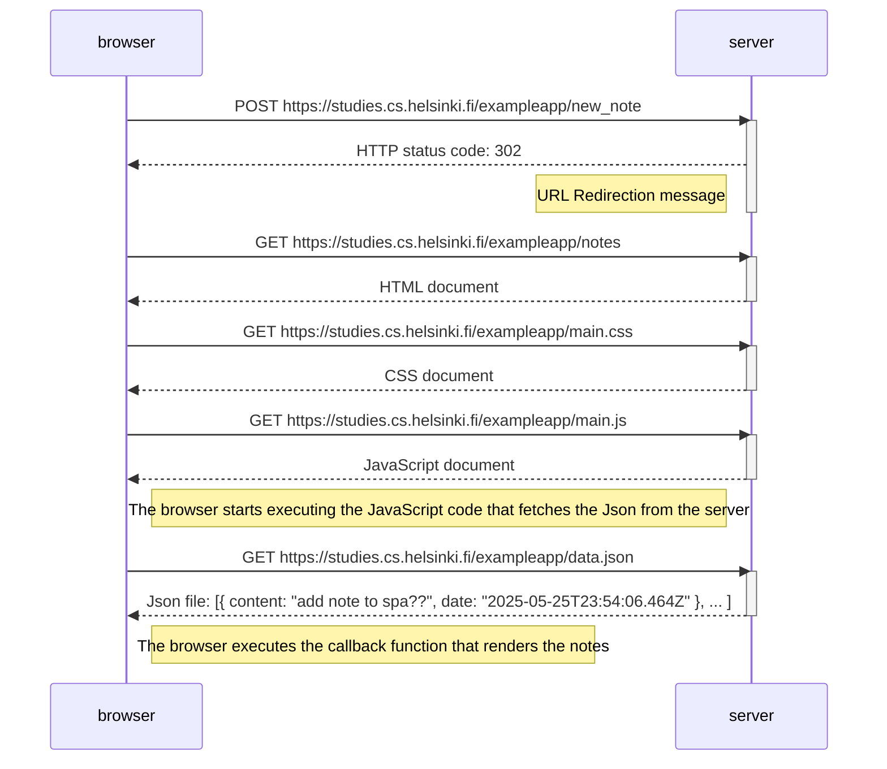

```mermaid
sequenceDiagram
participant browser
participant server

	browser->>server: POST https://studies.cs.helsinki.fi/exampleapp/new_note
	activate server
	server-->>browser: HTTP status code: 302 
	Note left of server: URL Redirection message
	deactivate server
	
	browser->>server: GET https://studies.cs.helsinki.fi/exampleapp/notes
	activate server
	server-->>browser: HTML document
	deactivate server
	
	browser->>server: GET https://studies.cs.helsinki.fi/exampleapp/main.css
	activate server
	server-->>browser: CSS document
	deactivate server
	
	browser->>server: GET https://studies.cs.helsinki.fi/exampleapp/main.js
	activate server
	server-->>browser: JavaScript document
	deactivate server
	
	Note right of browser: The browser starts executing the JavaScript code that fetches the Json from the server
	
	browser->>server: GET https://studies.cs.helsinki.fi/exampleapp/data.json
	activate server
	server-->>browser: Json file: [{ content: "add note to spa??", date: "2025-05-25T23:54:06.464Z" }, ... ]
	deactivate server
	
	Note right of browser: The browser executes the callback function that renders the notes

```