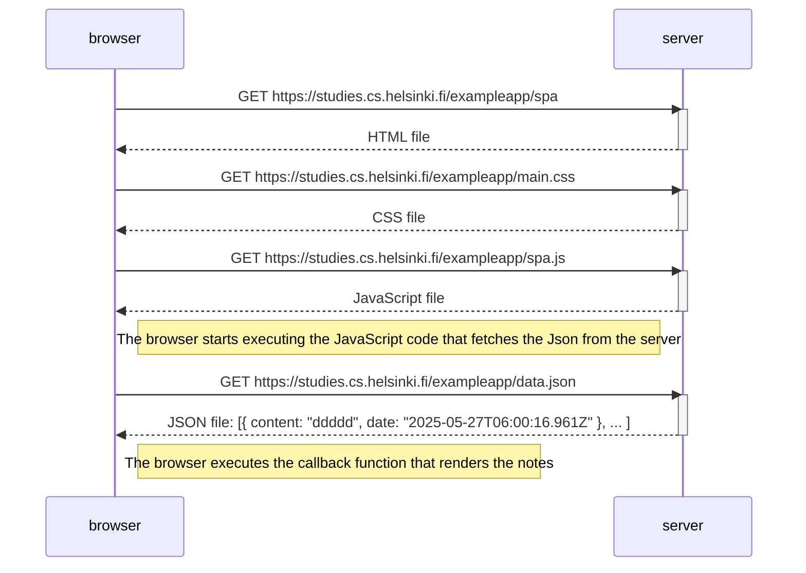

```mermaid
sequenceDiagram
participant browser
participant server

	browser->>server: GET https://studies.cs.helsinki.fi/exampleapp/spa
	activate server
	server-->>browser: HTML file
	deactivate server
	
	browser->>server: GET https://studies.cs.helsinki.fi/exampleapp/main.css
	activate server
	server-->>browser: CSS file
	deactivate server
	
	browser->>server: GET https://studies.cs.helsinki.fi/exampleapp/spa.js
	activate server
	server-->>browser: JavaScript file
	deactivate server
	
	Note right of browser: The browser starts executing the JavaScript code that fetches the Json from the server
	
	browser->>server: GET https://studies.cs.helsinki.fi/exampleapp/data.json
	activate server
	server-->>browser: JSON file: [{ content: "ddddd", date: "2025-05-27T06:00:16.961Z" }, ... ]
	deactivate server
	
	Note right of browser: The browser executes the callback function that renders the notes
```